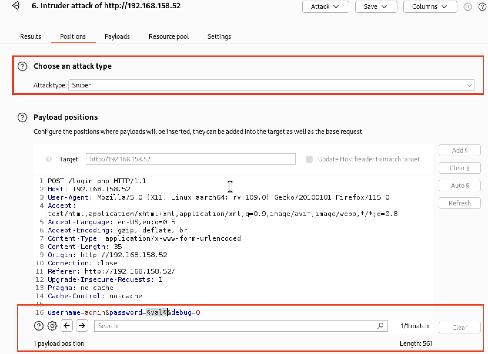
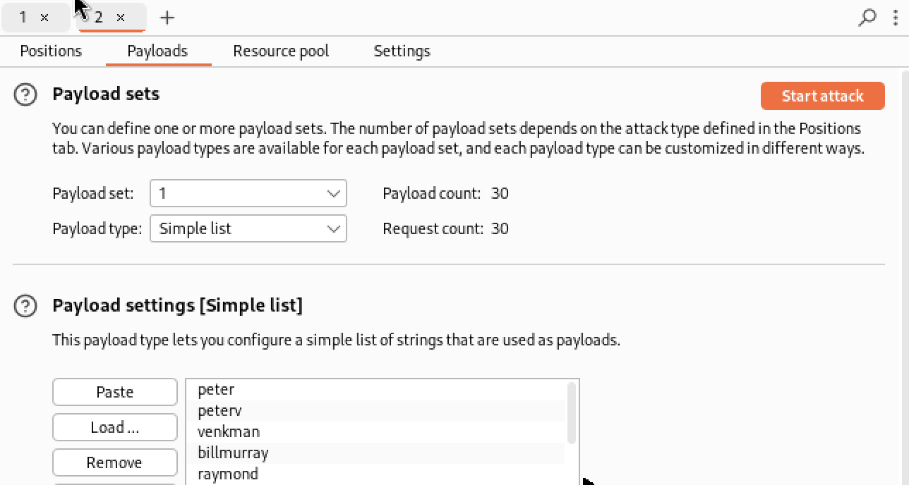

# Web Application Assessment

* Nmap for fingerprinting
* Wappalyzer for technology stack disclosure
* Gobuster for file and web directory discovery
* Burp Suite for manual web application testing

## Fingerprinting Web Servers with Nmap

```bash
# Fingerprint
sudo nmap -p80,443  -sV <targets>
PORT   STATE SERVICE VERSION
80/tcp open  http    Apache httpd 2.4.46 ((Ubuntu))
# Enumeration
sudo nmap -p80 --script=http-enum <targets>
```

## Assess technology stack with Wappalyzer (online web service)

* https://www.wappalyzer.com/
* a free sign up is required

## Discover web directories and files with GoBuster

Gobuster is a tool used to brute-force: URIs (directories and files) in web sites, DNS subdomains (with wildcard support), Virtual Host names on target web servers, Open Amazon S3 buckets, Open Google Cloud buckets and TFTP servers.

* `dir`for directory mode (default)
* -x file extensions e.g. html,php
* -s success status code 200,301
* -b bad/negative status code like 404
* -e print full path
* -u target
* -w wordlist
* -t threads for brute-force attack
* `tftp`for tftp mode
* `s3`for aws S3 mode
* `dns`for dns mode
* `fuzz` for URL fuzzing mode, replaces the word FUZZ

```bash
sudo apt install gobuster
gobuster dir -u <target> -w /usr/share/wordlists/dirb/small.txt -t 4
gobuster dir -u http://target.com/ -w /usr/share/wordlists/dirb/big.txt -t 4 -x html,htm
gobuster dir -v -b 301 -u <target> -w /usr/share/wordlists/dirb/common.txt -t 4
# Output example
/uploads              (Status: 301) [Size: 316] [--> http://192.168.50.20/uploads/
```

## Dirb

* works recursively by default

```bash
dirb http://target.com:80 /usr/share/wordlists/dirb/common.txt
```

## Brute-Force web login passwords with Hydra

```bash
hydra -f -vV -l admin -P passwords.lst <target> http-post-form '/login.php:username=^USER^&password=^PASS^&debug=0:Login Failed!'
```

## Web application assesment with Burp Suite

* Default proxy `https://127.0.0.1:8080`
* Configure firefox `about:preferences#general`
* Select `Manual proxy configuration`
* Enter 127.0.0.1
* Select `Also use proxy for HTTPS`
* Trouble Shoot captive portal issues
* Configure firefox `about:config`
* Disable `network.captive-portal-service.enabled`

Using Burp Intruder

* Use intruder for brute-force attacks
* Click Send to Intruder
* Configure
* Click `Payloads`
* Select `Simple List`
* Paste the plain text list the payload
* Click `Settings`
* Enter Login failed indicator

```bash
# copy to clipboard
apt install xclip
cat /usr/share/wordlists/rockyou.txt | xclip -sel clip
cat <(xclip -sel clip -o)
```

|  |
| :---: |
| *Configure a single position for Sniper* |

|  |
| :---: |
| *Paste the payload from clipboard* |

|  |
| :---: |
| *Configure login failed string* |

|  |
| :---: |
| *Result indicate a valid login* |

## Web Enumeration with Burp

Technology stacks always consists of `OS, web server, database, backend/frontend programming language`. 

HTTP Response Headers `Server:`, `X-Powered-By:` or `X-Forwarded-For` will often reveal the web server software and version.

E.g.
* "X-Powered-By": Nginx
* "x-amz-cf-id" Amazon CloudFront
* "X-Aspnet-Version" ASP .NET


